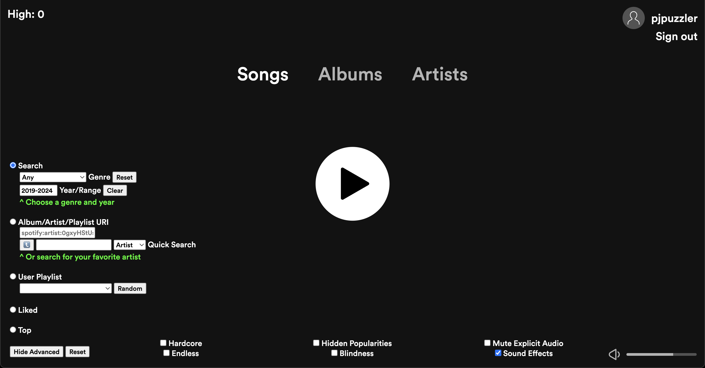
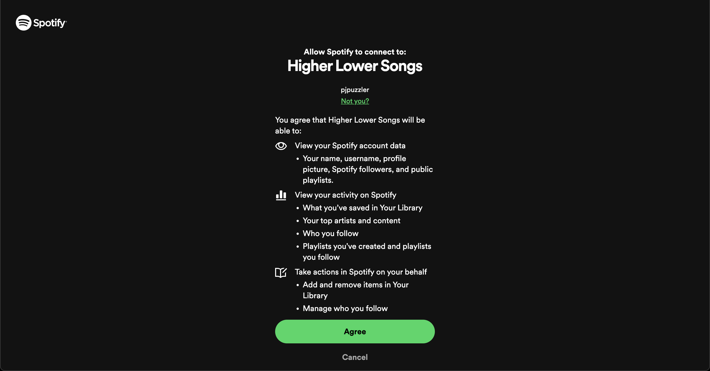

# [Play](https://pjpuzzler.github.io/higher-lower-songs)

A version of the Higher Lower game, but for music.

The scores are ratings (0-100) that Spotify estimates the popularity to be RIGHT NOW.

Credit to Vibrant.js for Spotify-like background gradients (https://jariz.github.io/vibrant.js/) as well as Spotify, iTunes and the respective artists.
